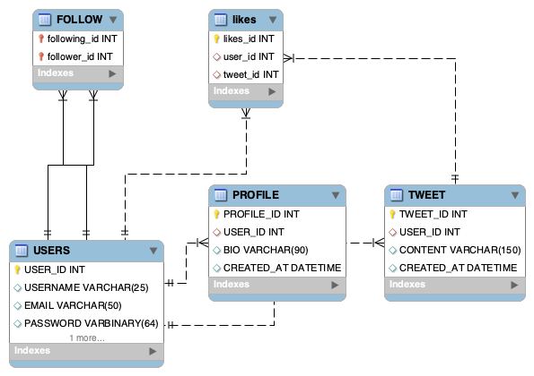

# X Platform Database

A SQL database project that simulates a social media platform similar to X (Twitter).

## ERD Diagram

The following diagram shows the database structure and the relationships between the tables.

## Technologies

* MySQL Workbench
* SQL

## Database Objects

* USERS
* PROFILE
* TWEET
* FOLLOW

## Features

* User account management
* Profile management
* Follow system
* Tweet management
* Password encryption using MD5
* Stored Procedures
